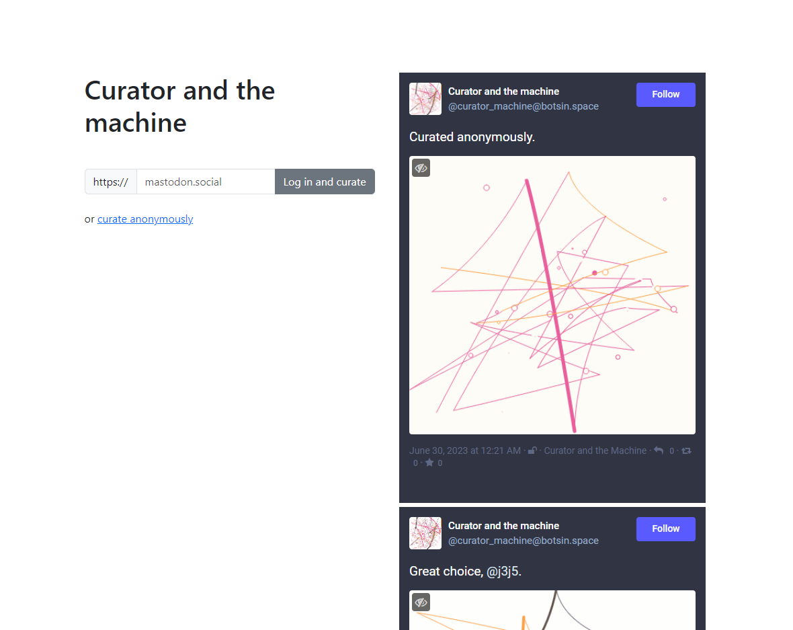

# Curator and the Machine

## About

This project explores ideas of creativity and authorship. The interface lets you curate the output of a random generative art script and share it via the [@curator_machine](https://stefanbohacek.online/@curator_machine) Mastodon bot.

## Development

If you'd like to make your own version, note that the fediverse login requires its own [authentication server](https://github.com/stefanbohacek/auth-server).

A future version of this project should make it easier to set this up.

You will also need to [create a Mastodon app](https://botwiki.org/resource/tutorial/how-to-make-a-mastodon-botsin-space-app-bot/) for your bot.

